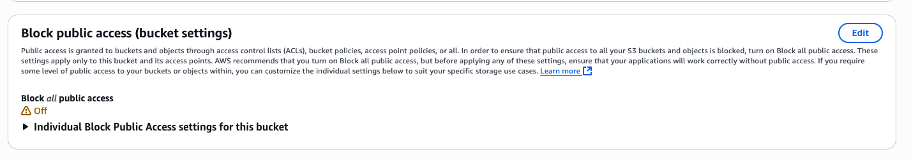
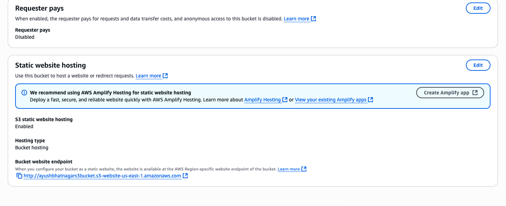
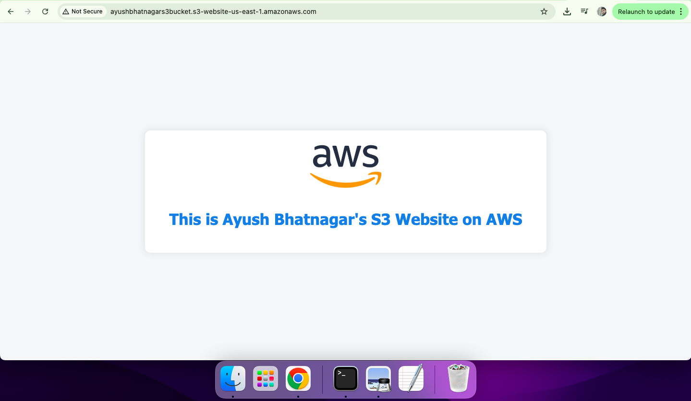

# aws-s3-static-site
Create a static website on AWS S3
Steps:
1) Go to the S3 console → Click “Create Bucket”

2) Bucket name must be globally unique. I used "ayushbhatnagars3bucket"

3) Uncheck "Block all public access"

4) Enable "Static website hosting" under Properties

5)Enter index.html as the index document

6) Upload index.html and Image file ( I used chatgpt to create the HTML file instead of the boring hello world script )

7)Set Bucket Policy to Allow Public Access ( So that we could access it from the internet )

8) Go to the Permissions tab and create a bucket policy ( You may choose policy generator or use chatgpt for this. Both are very easy to use )

9) To access your website
Go to Properties > Static Website Hosting. Copy the Website endpoint link and open it in your browser.

